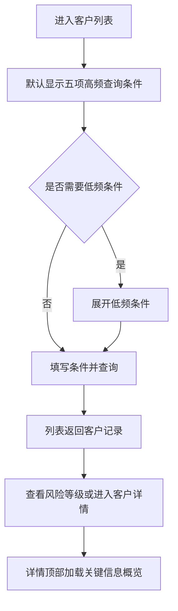
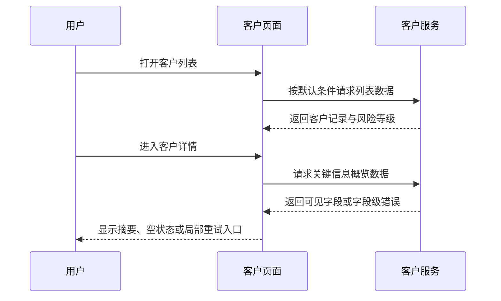

# PRD: DEMO-CRM-001 - 客户管理页面优化（演示稿）

演示说明：仅用于验证模板结构，业务数据与技术定位为演示假设，不作为真实研发依据。

---

## 需求基本信息

| 业务需求名称 | 客户管理页面优化（演示） | 需求优先级 | [待确认]（演示稿未进行优先级评审。） |
|---|---|---|---|
| 需求编号及链接 | DEMO-CRM-001（演示编号，无正式链接） | | |
| BRD评审会议纪要链接 | 不适用（演示稿未召开 BRD 评审会议） | PRD评审会议纪要链接 | 不适用（演示稿未召开 PRD 评审会议） |
| 所属系统 | 客户管理系统（演示假设） | 所属功能模块 | 客户列表、客户详情 |
| 产品经理 | [待确认]（演示稿未指定产品经理。） | 预估人天 | [待确认]（演示稿未进行研发估时，无法确认工作量和排期。） |

## 修订记录

| 版本 | 日期 | 修订人 | 审核人 | 修订说明 | 变更分类（产品/业务） |
|---|---|---|---|---|---|
| V1.0 | 2026-09-01 | [待确认]（演示稿未指定） | [待确认]（演示稿未指定） | 按九章模板编写客户管理页面优化演示需求，验证第四章目录与正文格式。 | 产品/业务 |

# 一、术语与缩写

| 术语/缩写 | 全称 | 定义说明 |
|---|---|---|
| 客户列表 | 客户管理列表 | 展示当前用户有权查看的客户记录，并提供查询、列配置和进入客户详情的入口。 |
| 高频查询条件 | 默认显示的查询条件 | 本演示中指客户编码、客户名称、客户状态、客户等级和归属人五项条件。 |
| 低频查询条件 | 收起后显示的查询条件 | 本演示中指所属行业、所在地区、创建时间和最后跟进时间四项条件。 |
| 风险等级 | 客户风险分级 | 用高风险、中风险、低风险和未评估表示客户风险状态；本稿的字段来源为演示假设。 |
| 关键信息概览 | 客户详情摘要区 | 位于客户详情页顶部，用于集中显示客户基础信息、最近跟进和有效合同摘要。 |
| 不适用（原因） | | 本演示不涉及的事项，后面紧跟不适用原因。 |

# 二、背景与目标

## （一）描述/痛点

客户列表页面在演示场景中一次展开全部查询条件，用户打开页面后需要先浏览多个低频条件才能找到客户编码、客户名称这类常用条件。列表默认列数量较多，用户需要横向滚动才能查看客户状态和归属人。风险等级字段可能因展示字段映射不完整而显示为空或显示为内部编码。客户详情页的最近跟进和有效合同信息分散在不同区域，用户无法在打开详情后快速判断客户当前状态。

以上现状、数据量和问题比例均为演示假设；真实页面、数据字段、接口和问题发生率未在代码库中核验。

## （二）目标/价值

| 量化维度 | 现状/基线 | 目标值 | 业务收益 | 度量口径 |
|---|---|---|---|---|
| 打开客户列表后找到常用查询条件的操作步骤 | [待确认]（演示文件未连接真实页面，无法确认当前点击次数。） | [待确认]（需用真实页面基线确定目标步骤数。） | 减少用户寻找查询入口的时间 | 选取有客户查询任务的用户，记录从页面打开到首次提交查询的点击次数；周期和样本量待确认。 |
| 查看客户风险状态所需页面区域 | [待确认]（演示文件未连接真实页面，无法确认当前字段位置。） | 风险等级在客户列表和详情概览中各有一个明确展示位置（演示目标） | 减少用户在多个区域之间切换 | 按同一客户记录检查列表字段与详情字段是否都有可读的风险等级；数据口径待真实系统确认。 |
| 从客户详情获取最近跟进与有效合同信息的时间 | [待确认]（演示文件未连接真实页面，无法确认当前耗时。） | [待确认]（需根据真实使用数据设定秒数目标。） | 帮助用户更快判断客户是否需要跟进 | 记录进入详情页到读完两类信息的时间；统计范围和采样方式待确认。 |

本演示的业务目标是明确默认查询、默认列、风险等级和详情摘要的产品规则，并把每个字段的输入、处理和用户结果写成可开发、可测试的要求。正式项目必须补齐真实基线、目标值和数据来源；在此之前只能验证文档结构，不能用本稿数字评估上线收益。

## （三）风险控制

| 风险 | 控制要求 |
|---|---|
| 用户误以为隐藏条件已清空 | 收起低频条件只改变显示状态，不清除已填写值；查询前在条件区显示“已设置 N 项”提示，并提供“清空全部条件”入口。 |
| 风险等级显示错误 | 列表和详情使用同一业务枚举映射；无法识别的值显示“未评估”，不得直接向用户展示内部编码。真实枚举来源待确认。 |
| 摘要信息越权 | 概览区复用客户详情已有数据权限；无权读取的字段不返回、不显示，不能因为摘要接口而扩大数据范围。 |
| 部分数据加载失败 | 列表主体、风险等级、详情摘要分别展示加载状态；某一摘要字段失败时保留其他已成功字段，并给出局部重试入口。具体服务能力待确认。 |

# 三、整体流程

## （一）业务/功能流程图

## （二）交互时序图

以上流程图为演示业务流程，不代表真实接口调用顺序。真实服务拆分、请求参数和返回结构均待代码库与接口文档确认。

# 四、功能性需求

## （一）正常业务场景

### 4.1 改动点：客户列表查询区与默认列调整

本改动点处理客户列表的默认查询条件、低频条件展开状态、默认列和旧列配置兼容，不改变客户记录的业务数据。

#### 4.1.1 查询条件：默认查询条件展示

适用页面：[待确认]（演示文件未连接代码库，无法确认客户列表页面入口；影响页面回归范围需在研发实施前核验。）

| 需求点 | 类型 | 原有实现 | 目标修改点 |
|---|---|---|---|
| 调整客户列表首次打开时的查询条件可见性 | 修改 | [待确认]（演示文件未连接代码库，无法确认当前默认展开条件和页面初始化状态；影响前端改动范围及回归用例。） | 查询区初始化与条件组装位置：[待确认]（演示文件未连接代码库，无法确认稳定代码位置；影响研发需先检索入口）。首次渲染仅展示客户编码、客户名称、客户状态、客户等级、归属人；所属行业、所在地区、创建时间、最后跟进时间改为低频条件，但已填写的低频条件仍进入查询请求。用户首次打开只看到五项常用条件，展开后可填写四项低频条件。 |
| 管理低频条件的展开、收起和清空状态 | 修改 | [待确认]（演示文件未连接代码库，无法确认现有展开状态是否持久化及清空按钮的覆盖范围；影响交互状态迁移。） | 查询区交互状态和清空处理位置：[待确认]（演示文件未连接代码库，无法确认稳定代码位置；影响状态迁移实现和回归范围）。展开、收起只切换低频条件的可见性，不清除已填值；“清空全部条件”同时重置九项查询条件及日期、人员选择。用户再次展开仍能看到原值，清空后提交查询得到无条件列表。 |

**实现约束与验收规则**

| 规则项 | 说明 |
|---|---|
| 默认条件 | 页面初始化只显示客户编码、客户名称、客户状态、客户等级、归属人；“更多条件”按钮显示为收起状态。字段顺序固定为客户编码、客户名称、客户状态、客户等级、归属人。 |
| 查询输入 | 客户编码和客户名称按演示中的文本输入处理；客户状态、客户等级、归属人、所属行业、所在地区使用可选控件；创建时间和最后跟进时间使用起止日期控件。具体匹配方式须在真实接口确认前标记待确认。 |
| 隐藏条件 | 收起只改变可见性，不删除值、不修改查询模型；提交查询时九项条件中非空值均参与筛选。 |
| 清空条件 | 清空动作覆盖九项条件、已选择的日期范围和已选择的人员；清空后不自动提交查询，用户点击“查询”后才刷新列表。 |
| 已设置提示 | 当隐藏条件中至少一项有值时，“更多条件”按钮旁显示“已设置 N 项”，N 为四项低频条件中非空条件数量；低频条件全部为空时不显示计数。 |
| 权限 | 查询结果继续使用当前登录用户的数据范围；本次页面调整不新增角色、不扩大可见客户范围。真实角色和数据范围待确认。 |

#### 4.1.2 列表：默认列精简与旧配置兼容

适用页面：[待确认]（演示文件未连接代码库，无法确认客户列表页面入口；影响页面回归范围需在研发实施前核验。）

| 需求点 | 类型 | 原有实现 | 目标修改点 |
|---|---|---|---|
| 收敛客户列表默认可见列 | 修改 | [待确认]（演示文件未连接代码库，无法确认当前默认列、固定列和默认顺序；影响列配置迁移方案与回归范围。） | 列表列定义和固定列配置位置：[待确认]（演示文件未连接代码库，无法确认稳定代码位置；影响默认列调整的实施入口）。默认列改为客户编码、客户名称、客户状态、客户等级、风险等级、归属人、所属行业、所在地区、最后跟进时间、更新时间，并保持该顺序；客户编码和客户名称设为左侧固定列。首次进入显示十列，横向滚动时仍能识别客户。 |
| 兼容已有用户列配置 | 修改 | [待确认]（演示文件未连接代码库，无法确认旧配置的保存位置、版本格式和失效处理方式；影响历史用户首次升级后的列显示。） | ① 个人列配置读取和迁移位置：[待确认]（演示文件未连接代码库，无法确认稳定代码位置；影响历史配置兼容方案）。保留仍存在字段的相对顺序，删除不存在字段，并把风险等级、所属行业、所在地区、最后跟进时间、更新时间补到末尾。 ② 配置回退位置：[待确认]（演示文件未连接代码库，无法确认稳定代码位置；影响异常配置处理）。缺失、解析失败或包含重复字段时恢复十列默认配置，并提示“列配置已恢复默认”。 |

**实现约束与验收规则**

| 规则项 | 说明 |
|---|---|
| 默认列清单 | 客户编码、客户名称、客户状态、客户等级、风险等级、归属人、所属行业、所在地区、最后跟进时间、更新时间十列为默认可见列；客户编码、客户名称为固定列；其余八列可通过列设置调整。 |
| 旧配置迁移 | 旧配置包含客户编码、客户名称、客户状态、客户等级、归属人时，按旧配置中这五列的相对顺序保留；新增五列风险等级、所属行业、所在地区、最后跟进时间、更新时间追加到末尾；旧配置中出现的未知字段直接丢弃。 |
| 空配置处理 | 用户未保存配置时直接使用默认列清单；用户主动恢复默认后清除个人列选择并重新使用十列。 |
| 配置异常 | 配置不是可解析的列清单、存在重复字段或缺少客户编码时，整份配置视为无效，使用十列默认配置；页面给出“列配置已恢复默认”提示，不影响客户查询结果。 |
| 列权限 | 列表只显示当前用户有权限读取的字段；若权限配置隐藏某一默认列，则从用户可见列中移除该列，页面不显示空白列。真实字段权限规则待确认。 |
| 数据空值 | 客户等级、风险等级、所属行业、所在地区、最后跟进时间为空时，单元格显示短横线；客户编码和客户名称为空时按数据接口异常处理，不以短横线掩盖异常。 |

#### 4.1.3 字段：风险等级显示修复

适用页面：[待确认]（演示文件未连接代码库，无法确认客户列表和客户详情的页面入口；影响跨页面回归范围需在研发实施前核验。）

| 需求点 | 类型 | 原有实现 | 目标修改点 |
|---|---|---|---|
| 统一风险等级的值到文案映射 | 修复 | [待确认]（演示文件未连接代码库，无法确认当前空值、数字值和中文值的映射逻辑；影响修复位置及数据兼容测试。） | 风险等级枚举映射模块：[待确认]（演示文件未连接代码库，无法确认稳定代码位置；影响修复入口和数据兼容测试）。补齐原始值到高风险、中风险、低风险、未评估的展示映射；无法匹配的非空值记录可定位的异常信息后统一输出“未评估”。列表和详情不再展示数字编码或空白占位。 |
| 补齐列表和详情的风险等级展示 | 修改 | [待确认]（演示文件未连接代码库，无法确认列表字段与详情字段是否使用同一数据来源；影响跨页面一致性回归。） | 列表与详情的字段渲染入口：[待确认]（演示文件未连接代码库，无法确认稳定代码位置；影响共用映射的接入方式）。两个页面复用同一风险等级映射；空值、缺失值和无法识别值均进入“未评估”分支，不新增排序规则。同一客户在两个页面显示相同等级文案，列表既有排序不变。 |

**实现约束与验收规则**

| 规则项 | 说明 |
|---|---|
| 映射清单 | 演示映射为高风险→高风险，中风险→中风险，低风险→低风险，空值或无法识别→未评估；真实系统的原始编码和字典版本需研发核验。 |
| 空值处理 | 服务未返回风险等级、返回空字符串或返回空值时展示“未评估”；不显示空白，不显示“null”，不显示数字编码。 |
| 异常值处理 | 服务返回未在映射清单内的非空值时展示“未评估”，同时记录字段异常信息；异常信息不展示给普通用户。 |
| 加载状态 | 列表加载期间显示字段骨架或加载标记；详情摘要加载期间风险等级显示加载标记；请求失败后显示“暂无法获取”，并提供“重试”入口，不把失败误显示为“未评估”。 |
| 权限 | 用户无权读取风险等级时，列表不显示风险等级列，详情不显示风险等级字段；无权状态不能被误判为未评估。真实权限返回方式待确认。 |
| 联动 | 列表风险等级与详情风险等级必须使用同一客户编码对应的最新成功返回值；进入详情后不修改客户风险等级数据。 |

### 4.2 改动点：客户详情关键信息概览

本改动点在客户详情页增加顶部关键信息概览，只读展示客户当前经营判断所需的摘要字段，不改变客户、跟进或合同数据。

#### 4.2.1 区块：客户详情关键信息概览

适用页面：[待确认]（演示文件未连接代码库，无法确认客户详情页面入口；影响页面回归范围需在研发实施前核验。）

| 需求点 | 类型 | 原有实现 | 目标修改点 |
|---|---|---|---|
| 新增客户详情顶部关键信息概览区 | 新增 | 不适用（新增） | 详情顶部布局和摘要数据装配位置：[待确认]（演示文件未连接代码库，无法确认稳定代码位置；影响新增组件和数据接入范围）。在客户详情标题下新增只读概览容器，按客户基础信息、风险信息、最近跟进、有效合同分组；按当前客户编码和现有数据权限加载八项摘要。用户无需切换页签即可看到当前客户且有权读取的信息。 |
| 定义概览字段和点击跳转 | 新增 | 不适用（新增） | 概览字段配置和页签导航位置：[待确认]（演示文件未连接代码库，无法确认稳定代码位置；影响字段与页签的接入方案）。建立字段跳转映射：客户名称、客户等级、归属人进入基础信息，风险等级进入风险信息，最近跟进字段进入跟进记录，合同字段进入合同；无对应权限时禁用跳转。用户点击字段后保留当前客户编码，不会进入无权页签。 |
| 处理摘要空数据和局部失败 | 新增 | 不适用（新增） | 摘要字段渲染和请求状态位置：[待确认]（演示文件未连接代码库，无法确认稳定代码位置；影响局部失败和重试实现）。单字段为空显示短横线，整组无数据时隐藏该组；单字段请求失败显示“暂无法获取”并提供字段级重试，成功字段继续展示。重试成功后仅更新对应字段，不刷新其他摘要。 |

**实现约束与验收规则**

| 规则项 | 说明 |
|---|---|
| 字段口径 | 客户名称取当前客户主档名称；客户等级取当前客户主档等级；风险等级按 4.1.3 的映射；归属人取当前客户负责人；最近跟进时间取客户跟进记录中时间最新的一条；最近跟进方式取该条记录的方式；有效合同数量统计状态为有效的合同记录数量；有效合同金额统计状态为有效的合同金额合计。上述数据来源和状态字典属于演示假设，正式研发前必须核验。 |
| 字段展示顺序 | 基础信息组依次显示客户名称、客户等级、归属人；风险信息组显示风险等级；最近跟进组依次显示最近跟进时间、最近跟进方式；有效合同组依次显示有效合同数量、有效合同金额。 |
| 金额格式 | 有效合同金额按人民币金额格式展示，保留两位小数并添加千分位；币种不是人民币时展示实际币种符号和金额，币种换算规则待确认。 |
| 跳转规则 | 客户名称、客户等级、归属人跳转基础信息页签；风险等级跳转风险信息页签；最近跟进时间、最近跟进方式跳转跟进记录页签；有效合同数量、有效合同金额跳转合同页签；跳转失败时保留当前详情页并显示页面提示。 |
| 空数据 | 单个字段为空显示短横线；同一组四项规则分别适用；一组内字段全部为空或全部失败时隐藏该组，避免出现只有标题的空区块。 |
| 加载状态 | 首次加载显示四组骨架；字段成功后替换对应骨架；局部失败不阻塞其他组；用户点击某字段“重试”只重新请求该字段所属数据。 |
| 权限 | 基础信息、风险信息、跟进记录、合同页签继续使用现有数据权限；无权限字段不返回且不显示；若整组字段均无权限则隐藏该组。真实角色、权限码和数据范围待确认。 |
| 联动 | 从列表进入详情时传递当前客户编码；概览所有字段只读；概览不提供编辑、删除或保存操作；用户从概览跳转页签后，页签仍定位到同一客户。 |

## 边界场景

| 系统边界 | 系统表现 | [待确认]及影响 |
|---|---|---|
| 超时 | [待确认]（演示建议：查询或概览请求超时后停止加载状态，保留已输入条件和已成功字段，并显示重试入口；真实超时阈值和请求取消机制待研发核验。） | 影响查询等待时间、提示文案和自动化测试的时间阈值；研发评审时需补充具体阈值及重试次数。 |
| 并发 | [待确认]（演示建议：用户连续点击查询或重复点击重试时，只保留最后一次请求的可见结果，旧请求返回不得覆盖新结果；真实请求序列控制方式待研发核验。） | 影响重复请求的服务压力、列表最终结果和局部重试状态；研发评审时需确认是否需要请求序列号或取消前次请求。 |
| 数据量极值 | [待确认]（演示建议：客户列表按分页返回，概览只读取当前客户摘要；单个字段超长时截断展示并支持悬浮查看；真实分页上限、文本长度和金额范围待研发核验。） | 影响分页性能、表格横向布局、长文本交互和压测数据准备；研发评审时需补充分页上限与字段长度。 |

预估人天尚未确认，因此三类边界均保留演示建议和待研发核验影响，不将建议误写为现有系统事实。

## （二）异常业务场景

| 异常场景 | 处理规则 | 用户可见结果 |
|---|---|---|
| 查询条件组合没有匹配客户 | 服务返回空列表且无服务错误时，保留当前九项查询条件，不把空结果当成请求失败。 | 列表显示“暂无符合条件的客户”，用户可修改条件或点击清空全部条件。 |
| 查询服务返回失败 | 终止本次列表加载，保留已输入条件和上一次成功列表；提供“重试查询”入口。 | 显示具体可读错误提示；点击重试后重新提交当前条件。 |
| 风险等级值无法识别 | 按 4.1.3 处理为“未评估”，同时记录异常信息。 | 用户看到“未评估”，不会看到数字编码或空白。 |
| 客户编码已失效或无权访问详情 | 进入详情前重新校验客户编码和数据权限，失败时不展示摘要数据。 | 显示“客户不存在或无权查看”，提供返回客户列表入口。 |
| 摘要部分字段服务失败 | 仅将失败字段置为失败状态，不清除成功字段；重试只请求失败字段所在的数据组。 | 成功字段继续可读，失败字段显示“暂无法获取”和“重试”。 |
| 用户快速切换详情客户 | 取消或忽略前一个客户的未完成请求；回调必须校验当前客户编码，旧客户响应不能写入新客户页面。 | 页面只显示当前打开客户的摘要，不出现客户信息串页。 |
| 旧列配置无法解析 | 使用十列默认配置，记录配置恢复事件，不阻断客户列表查询。 | 显示“列配置已恢复默认”，用户仍能查询和调整列。 |

# 五、角色权限

| 角色 | 功能/页面 | 权限范围 | 数据范围 | 备注 |
|---|---|---|---|---|
| 客户查看人员 | 客户列表、客户详情 | 可查询有权客户，可查看有权字段；不可编辑概览字段。 | 仅查看本人或组织授权范围内的客户。 | 角色名称和实际权限配置为演示假设，待真实系统核验。 |
| 客户管理人员 | 客户列表、客户详情 | 在客户查看人员权限基础上，可调整个人列配置和查询条件。 | 组织授权范围内的客户。 | 本需求不新增数据编辑权限。 |
| 无客户查看权限用户 | 客户列表、客户详情 | 不可进入客户列表和客户详情。 | 无客户数据。 | 具体未授权页面提示待确认。 |

# 六、非功能性需求

## （一）用户与业务规模

| 项目 | 内容 |
|---|---|
| 用户规模 | [待确认]（演示文件未连接用户统计，无法确认日活用户和并发用户数量。） |
| 客户数据规模 | [待确认]（演示文件未连接数据源，无法确认客户记录总量、增长速度和单客户跟进记录数量。） |
| 使用场景 | 客户查看人员和客户管理人员在 PC 页面进行条件查询、列表浏览和详情查看；移动端不在本演示范围内。 |

## （二）性能指标要求

| 指标项 | 目标值 | 测量方法 | 备注 |
|---|---|---|---|
| 列表首次加载 | [待确认]（演示稿未进行性能基线测试。） | 使用与正式环境接近的数据量，记录从提交请求到列表可交互的时间；阈值和样本量待确认。 | 需同时统计默认查询和九项条件组合查询。 |
| 详情概览加载 | [待确认]（演示稿未进行性能基线测试。） | 记录进入详情到四组摘要完成或显示局部失败状态的时间；阈值待确认。 | 不应阻塞客户详情主体内容。 |
| 查询并发 | [待确认]（演示稿未取得并发用户基线。） | 按正式用户规模模拟并发查询，观察错误率、响应时间和数据串页情况。 | 并发上限和告警阈值待确认。 |

## （三）安全要求

客户编码、客户名称、归属人、跟进和合同金额只允许在既有数据权限范围内返回。概览接口不得因为增加摘要字段而绕过原有字段权限；页面日志不得记录客户合同金额这类敏感业务内容。传输加密、日志脱敏策略和审计字段待真实系统核验。

## （四）高可用要求

列表主体和详情概览需要支持局部失败：列表服务失败时保留上一次成功列表，概览某一数据组失败时不影响其他数据组。是否已有统一降级、限流和服务重试能力待确认；本演示不新增独立高可用组件。

## （五）监控告警要求

至少需要能够区分列表查询失败、风险等级映射异常、详情摘要分组失败和旧列配置解析失败。监控指标名称、采集方式、告警阈值、通知对象和保留周期待真实系统核验；日志中不得写入客户名称、合同金额和完整查询条件。

# 七、配置与开关

| 配置项名称 | 配置Key | 默认值 | 可选值 | 是否热生效 | 说明 |
|---|---|---|---|---|---|
| 不适用（原因） | | | | | 本演示将默认查询条件、默认列表列和概览字段作为固定产品规则，不新增运营配置或开关；若真实系统要求灰度发布，配置项需在研发评审时另行补充。 |

# 八、测试关注点

## （一）影响范围分析

### 关联改动与风险

| 直接改动 | 关联影响 | 可能风险 | 建议处理 | 是否需要产品决策 |
|---|---|---|---|---|
| 客户列表查询条件的默认可见性和清空范围 | 客户查询、查询条件回显、无条件查询结果 | 收起低频条件时误清空已填写值，导致查询结果与用户预期不符。 | 用九项条件逐项覆盖初始化、展开、收起、清空和提交场景；真实查询参数和当前行为待代码核验。 | 是；确认收起是否只隐藏、清空是否需要自动提交。 |
| 客户列表默认列和个人列配置迁移 | 客户列表横向布局、列设置、用户历史偏好 | 旧配置中未知字段或重复字段导致表格渲染失败，新增风险等级列被错误隐藏。 | 使用合法字段白名单解析旧配置；配置异常回退十列默认配置；真实配置格式待代码核验。 | 是；确认新增五列在旧用户配置中追加还是按默认顺序重置。 |
| 风险等级字段映射 | 客户列表、客户详情、风险筛选和字段权限 | 原始编码、中文值和空值混用时出现错误文案；无权限状态被误判为未评估。 | 固定四种文案映射并区分空值、异常值、请求失败和无权限；真实字典来源待确认。 | 是；确认未知编码是否统一显示“未评估”。 |
| 客户详情关键信息概览 | 基础信息、风险信息、跟进记录、合同页签和详情权限 | 多组数据请求部分失败或响应乱序时出现空区块、旧客户信息或越权字段。 | 采用字段组状态管理，按当前客户编码校验响应；局部重试且不改变主体详情；真实服务拆分待代码核验。 | 是；确认最近跟进和有效合同的业务口径。 |

### 回归范围

需要回归客户列表首次进入、九项查询条件组合、查询结果为空、查询失败重试、客户编码进入详情、客户详情页签跳转、风险等级列表与详情一致性、个人列配置保存与恢复默认、无权限用户访问、不同客户快速切换和详情局部失败恢复。真实受影响页面和共用数据服务待选择代码库后补充；本演示不把未核验的页面路径或接口名称作为事实。

## （二）异常场景关注点

测试需要重点确认服务失败、字段缺失、风险等级未知值、历史列配置损坏、权限不足、客户已删除、请求超时、连续查询和快速切换客户时的用户可见结果。每个失败场景都要区分“没有数据”“没有权限”“服务失败”三种状态，不能用同一个短横线或统一空页面代替。详情概览应验证部分字段成功时仍能使用成功字段，重试后不得刷新或覆盖其他成功字段。

## （三）验收清单

### 正常情况

- [ ] 首次进入客户列表时只显示客户编码、客户名称、客户状态、客户等级、归属人五项条件。
- [ ] 展开“更多条件”后显示所属行业、所在地区、创建时间、最后跟进时间四项条件。
- [ ] 收起“更多条件”不会清除四项低频条件；提交查询时九项条件中的非空值均生效。
- [ ] 默认列表按客户编码、客户名称、客户状态、客户等级、风险等级、归属人、所属行业、所在地区、最后跟进时间、更新时间顺序显示十列。
- [ ] 风险等级能够显示高风险、中风险、低风险或未评估四种文案。
- [ ] 进入客户详情后，顶部概览按四组显示八项字段，并能按字段映射跳转到对应页签。

### 异常情况

- [ ] 查询服务失败时保留已输入条件和上一次成功列表，并显示可操作的重试入口。
- [ ] 风险等级为空或无法识别时显示“未评估”；请求失败时显示“暂无法获取”，两者不能混淆。
- [ ] 详情概览某一数据组失败时，其他成功数据组继续显示，失败组可单独重试。
- [ ] 历史列配置无法解析时自动使用十列默认配置，并显示列配置恢复提示。
- [ ] 客户不存在或无权访问详情时不返回摘要数据，并显示返回客户列表入口。

### 边界情况

- [ ] 请求超时后的页面保留已输入查询条件，停止无期限加载，并提供重试入口；具体阈值以研发确认值为准。
- [ ] 连续点击查询、重试或快速切换客户时，旧请求结果不能覆盖最后一次操作对应的数据。
- [ ] 客户列表达到真实分页上限时仍能翻页；超长客户名称、跟进方式和金额按确认的截断与查看规则展示。
- [ ] 九项查询条件全部为空时，查询结果仍受既有数据权限约束，不返回越权客户。

### 权限情况

- [ ] 有客户查看权限的用户只能看到数据范围内的客户列表、风险等级和详情摘要。
- [ ] 无风险等级字段权限时，列表不出现风险等级列，详情不出现风险等级字段，不显示“未评估”代替无权限。
- [ ] 无跟进或合同权限时，详情概览隐藏对应组或字段，不显示空白占位，不允许通过跳转绕过权限。
- [ ] 概览所有字段均为只读，用户不能在概览区修改客户、跟进或合同数据。

### 兼容情况

- [ ] 没有个人列配置的用户进入页面后使用十列默认配置。
- [ ] 旧配置含合法字段时保留合法字段相对顺序，并把新增字段按迁移规则追加。
- [ ] 旧配置含未知字段、重复字段或缺少客户编码时回退十列默认配置，列表查询仍可使用。
- [ ] 客户列表既有查询结果、分页、进入详情和返回列表行为不因默认条件和默认列调整而失效。
- [ ] 既有详情页签、客户数据权限和字段权限规则继续生效。

## （四）性能压测要求

与第六章性能指标对应。正式压测前需要准备真实规模的脱敏客户、跟进和合同数据，验证默认五项查询、九项组合查询、列表分页、详情四组摘要并行加载和局部重试。目标响应时间、并发用户数、错误率阈值和数据量上限均为 [待确认]（演示稿未连接真实运行环境，无法给出可执行压测参数）。

## （五）数据准备要求

需要准备脱敏演示数据：至少包含有风险等级和无风险等级的客户、四种风险等级文案对应值、已保存旧列配置和损坏列配置的用户、无跟进记录客户、存在多条跟进记录客户、无有效合同客户、存在多份有效合同客户、不同权限范围的用户。具体数量、字段编码、客户数据授权范围和脱敏方式待真实系统核验。

# 九、参考文档

不适用（原因）：本文件是用于验证 PMD 模板结构的演示 PRD，未连接真实原型、数据分析、会议纪要、接口文档或代码库。正式需求评审前应补充经确认的原型、业务数据依据、评审纪要和技术定位信息。
