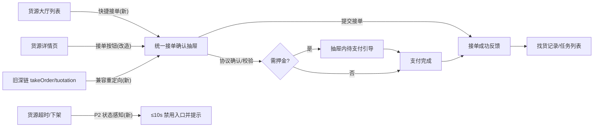
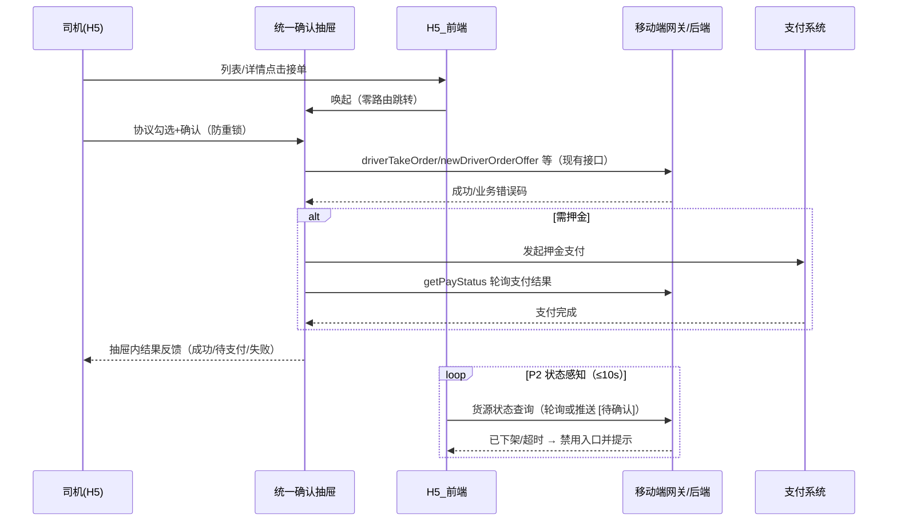

# PRD: req_k4t7vq2m - 司机接单流程优化

---

## 需求基本信息

| 业务需求名称 | 司机接单流程优化（P1 入口效率 + P2 状态实时感知） | 需求优先级 | 【选填】P1（建议，[待确认] 由业务方定级） |
|---|---|---|---|
| 需求编号 | [必填] [待确认]（业务方立项后补充编号与链接；内部运行标识 req_k4t7vq2m 仅供过程追踪） | | |
| BRD评审 会议纪要链接 | 【选填】不适用（暂无 BRD 评审） | PRD评审 会议纪要链接 | 【选填】[待确认]（PRD 评审后补充） |
| 所属系统 | [必填] TMS（运输管理，[AI 推断] 依据货源大厅/司机接单业务形态，[待确认]） | 所属功能模块 | 【选填】司机端-货源大厅/任务详情接单 |
| 产品经理 | [必填] [待确认] | 预估人天 | [必填] [待确认]（P1 前端约 6~10 人天、P2 视后端接口形态另计，[AI 推断]） |

---

## 修订记录 [必填]

| 版本 | 日期 | 修订人 | 审核人 | 修订说明 | 变更分类（产品/业务） |
|---|---|---|---|---|---|
| V1.0 | 2026-08-19 | [待确认] | [待确认] | 初稿：基于代码调研与需求访谈生成 | 产品 |
| | | | | | |

---

# 一、术语与缩写 [建议填写]

> 定义本文档中使用的专有术语、缩写、业务概念，确保各方对齐理解。

| 术语/缩写 | 全称 | 定义说明 |
|---|---|---|
| 链路 A | 货源大厅接单 | 司机主动找货：列表→详情→确认页，按 freightType 分四类 |
| 链路 B | 任务详情接单 | 平台派单场景：手动接单 + 服务端自动接单倒计时 |
| freightType | 货源交易类型 | 0 抢单 / 1 报价 / 2 认领 / 3 一口价（代码确认） |
| driverConfirmStatus | 司机确认状态 | '' 未确认 / '20' 已确认接单 / '30' 拒绝（代码确认） |
| 统一接单确认抽屉 | AcceptOrderDrawer | 本次新建的列表/详情共用底部确认组件（[AI 推断] 命名） |
| 押金 | Deposit | 一口价/抢单成功后的保证金，支付状态经 getPayStatus 查询 |
| 找货记录 | SupplyRecord | 接单/报价成功后的结果页 |

---

# 二、背景与目标

## （一）描述/痛点 [必填]

司机在 H5（内嵌原生 App）完成接单，现状存在两条链路（均为代码确认事实，证据见交接附录 A）：

1. **链路 A（货源大厅）**：列表卡片 → 详情页 → 接单/报价确认页，需 **3 次页面跳转**才能完成一次接单提交（EV-01/02/03/04）。
2. **链路 B（任务详情）**：派单手动接单与自动接单倒计时并存，前端仅做倒计时展示（EV-06/07）。

**客观实现依据（代码事实）**：全仓库无 WebSocket/SSE 推送，货源超时/下架后前端不会主动感知，依赖司机手动刷新或下次进详情才暴露（EV-10/12）；防重仅靠 `isLoading`/`isLock` 状态锁（EV-03/04）；接单成功后的押金支付为割裂的弹窗环节（EV-13）。

**业务量化数据 [待确认]**：月均抢单量、超时流失订单数、接单环节投诉量等数据缺口需业务方补充；影响：无法校准痛点优先级与收益估算，本 PRD 以实现层事实作为立项依据（需求来源：产品访谈 2026-08-19）。

## （二）目标/价值 [必填]

**价值归类**：用户体验 + 降本提效。

**衡量指标（Q8 已确认）**：

| 指标 | 现状 | 目标 | 度量方式 |
|---|---|---|---|
| 接单操作步骤 | 3 跳（列表→详情→确认页） | **≤2 步**（唤起抽屉 + 确认） | 接单埋点（T-05） |
| 平均接单耗时 | 基线 [待确认]（P1 埋点先行采集） | 较基线下降 **≥30%** | 接单埋点（T-05） |
| 货源状态感知时延 | 无主动感知（手动刷新） | **≤10 秒**（P2，AC-07） | 联调时延抽样 |

## 风险控制 【选填】

不涉及资金结算规则变更（押金支付链路保持现状语义）；不新增敏感数据采集，埋点仅含步骤数与耗时，不含个人敏感字段 [AI 推断：埋点字段清单待 T-05 设计评审确认]。

---

# 三、整体流程

## （一）业务/功能流程图 【选填】

## （二）交互时序图 [涉及多系统交互时必填]

---

# 四、功能性需求 [必填]

> 阶段划分：P1 = A/B/C/D/E/G（纯前端）；P2 = F（后端配合，排期 [待确认]）。追踪链 ID（Impact/Task/AC）见交接附录 C 与分析文档。

## （一）正常业务场景 [必填]

### A 功能：统一接单确认抽屉（P1，T-01，IMP-01/02/03）

列表卡片与详情页均可唤起同一个底部确认抽屉，抽屉内完成协议确认、信息展示与接单提交，全程零页面跳转。

- 列表卡片在现有「去抢单/去报价/去认领/去抢单(一口价)」按钮基础上直接唤起抽屉（保留进入详情的次入口）。
- 详情页底部主按钮由「跳转确认页」改为「唤起抽屉」，详情信息展示职责不变。
- 抽屉内容按 freightType 自适应：抢单/认领/一口价为确认型；报价型含价格输入 [待确认：报价类是否首批开放列表快捷入口]。
- iOS 内置组件宿主（现 `showView='takeOrder'` 路径）需等效迁移 [待确认：迁移方式]。

#### 输入/输出规则 [必填]

| 输入 | 校验规则 |
|---|---|
| orderNo（货源号） | 非空，来自列表/详情现有数据，长度与格式沿用现有接口 |
| freightType | ∈ {0,1,2,3}，决定抽屉交互形态 |
| 协议勾选 | 必选（沿用现有「同意使用姓名、手机号用于成交履约」协议） |
| 报价金额（仅 freightType=1） | 正数，小数位 ≤2，上下限沿用现有报价规则 [待确认：沿用字段] |
| 输出 | 提交结果状态（成功/待支付/失败+错误码文案）、步骤数与耗时埋点事件 |

### B 功能：旧确认页兼容与迁移（P1，T-02，IMP-04）

现有 TakeOrder/Tuotation 独立确认页的逻辑（校验、提交、押金判断）迁入抽屉；旧深链 `/takeOrder?orderNo=x` 保持可用或 302 至新交互 [待确认：最终去留策略，灰度期保留]。

#### 输入/输出规则 [必填]

| 输入 | 校验规则 |
|---|---|
| 旧深链参数 orderNo 等 | 与现有一致，缺失时走现有错误提示 |
| 输出 | 旧深链可完成等价接单（AC-03），无白屏/死链 |

### C 功能：接单结果反馈闭环（P1，T-03，IMP-05）

接单提交结果在抽屉内闭环反馈：成功（含抢单成功文案）、需押金（展示待支付状态并可发起支付，支付结果回查 `getPayStatus`）、失败（错误码映射文案 + 重试/返回引导）。成功后保留跳转找货记录的出口。

#### 输入/输出规则 [必填]

| 输入 | 校验规则 |
|---|---|
| 接单接口响应 code | 沿用现有业务错误码体系（AA001/AE001/AE002/SUPLY_CODE_001 等） |
| 支付状态查询结果 | 沿用 getPayStatus 返回结构 |
| 输出 | 三态反馈 + 后续动作引导；文案不替换具体错误语义 |

### D 功能：防重与加载反馈统一（P1，T-04，IMP-04）

提交中按钮禁用并展示加载态；统一防重实现（替代散落的 `isLoading`/`isLock`/`loadingFlag`），保证连点仅产生一次接单请求（幂等由前端防重保证第一层）。

#### 输入/输出规则 [必填]

| 输入 | 校验规则 |
|---|---|
| 点击事件 | 提交进行中忽略后续点击 |
| 输出 | 请求计数恒为 1（AC-05），加载态可见 |

### E 功能：接单效率埋点（P1，T-05，IMP-08）

在接单链路各环节（入口曝光→抽屉唤起→确认提交→结果返回）上报步骤数与耗时事件，用于验证 ≤2 步与 -30% 目标 [待确认：埋点方案接入现有体系的方式]。

#### 输入/输出规则 [必填]

| 输入 | 校验规则 |
|---|---|
| 事件字段 | 入口类型（列表/详情/深链）、freightType、步骤序号、环节耗时 ms |
| 输出 | 看板可查询的步骤数分布与平均耗时 |

### F 功能：货源状态实时感知（P2，T-06，IMP-06）

司机浏览期间货源被下架/超时后，前端在 ≤10 秒内禁用入口并提示；技术形态为前端轻量轮询起步，后端推送接口列为配合需求 [待确认：接口形态与排期]。轮询失败静默降级为现有手动刷新行为。

#### 输入/输出规则 [必填]

| 输入 | 校验规则 |
|---|---|
| 货源状态查询响应 | 可接/已下架/已超时 三态 |
| 输出 | 入口禁用 + 状态提示；感知时延 ≤10s（AC-07） |

### G 功能：状态枚举代码健康（P1，T-07，IMP-07）

修正 `driverTaskStatus` API 注释（现注释 10/20/30/40 与运行值 60/70/50 不一致）并沉淀为类型常量，无用户可见界面变化。

#### 输入/输出规则 [必填]

| 输入 | 校验规则 |
|---|---|
| 枚举值 | 与运行值 60（可抢）/70（已报价抢单）/50（已取消）一致 |
| 输出 | `pnpm typecheck` 通过（AC-08） |

## 边界场景 [必填]

- **请求超时**：接单请求沿用 60s 超时（现状）；超时后抽屉展示失败态与重试入口，不自动重发（现状无自动重试，保持）。
- **并发冲突**：提交瞬间货源被他人抢走/下架，接口返回业务冲突码时，抽屉内提示「手慢了，货源已被抢/已下架」并引导返回列表（错误文案映射 [待确认：与后端对齐冲突码清单]）。
- **倒计时边界**：详情页抢单倒计时归零瞬间提交，以后端校验结果为准，前端不做本地拦截判定（现状语义保持）。
- **连点极值**：100ms×10 连点仅 1 次请求（AC-05）。
- **支付中断**：押金支付中途退出，抽屉保持待支付态，可重新发起；支付结果以 `getPayStatus` 回查为准。
- **数据量极值**：列表长列表滚动中唤起抽屉，抽屉不随列表重渲染错位（组件级隔离）。

## （二）异常业务场景 [必填]

| 异常场景 | 系统行为 |
|---|---|
| 接单接口业务失败（余额/资质/车型不符等） | 抽屉内展示具体错误码映射文案与「去认证」等现有引导，不泛化错误 |
| 401 登录态失效 | 沿用现有「您长时间未登录」弹窗与登录跳转，抽屉关闭 |
| 押金支付失败 | 抽屉保持待支付态，展示失败原因与重试；不影响已成功的接单关系（现状语义） |
| 链路 B 自动接单与手动操作并发 | 以服务端结果为准，前端倒计时结束后的 3s 刷新逻辑保持（现状） |
| P2 状态接口异常 | 静默降级为现有手动刷新体验，不阻塞接单主流程 |
| 旧深链参数缺失/货源不存在 | 沿用现有错误提示路径，无白屏（AC-03） |

---

# 五、角色权限 [必填]

> 本次无新增菜单/按钮权限变更：快捷接单入口沿用现有司机端货源大厅与任务详情的入口权限，不新增角色。

| 角色 | 功能/页面 | 权限范围 | 数据范围 | 备注 |
|---|---|---|---|---|
| 司机 | 货源大厅列表/详情、统一接单确认抽屉 | 查看/接单提交 | 本人可见货源（现状） | 无权限变更 |
| 司机 | 任务详情（链路 B） | 查看/手动接单 | 本人任务（现状） | 无权限变更 |
| 运营/后台 | 货源下架（P2 联调用） | 编辑（现有） | 全部 | 仅测试联动，无变更 |

---

# 六、非功能性需求 [必填]

## （一）用户与业务规模

目标用户为全部活跃司机（H5 端）；具体司机数量、日均接单量 [待确认：业务方补充]。增长预期按现有业务自然增长，本需求不改变单量模型。

## （二）性能指标要求

| 指标项 | 目标值 | 测量方法 | 备注 |
|---|---|---|---|
| 抽屉唤起时间 | ≤300 ms（TP99，[AI 推断] 待性能评审确认） | 前端性能埋点 | 本地渲染，不含接口 |
| 接单接口响应时间 | 沿用现状基线，不劣化 | 网关监控 | 接口不改协议，仅入口变化 |
| 埋点上报 | 异步上报，不阻塞接单主流程 | 埋点耗时抽样 | 上报失败静默丢弃 |
| P2 状态感知时延 | ≤10 s | 联调时延抽样 | AC-07 |

## （三）安全要求 [建议填写]

埋点事件不含姓名、手机号等敏感字段（仅入口类型/freightType/步骤/耗时）；协议确认与鉴权沿用现有 token/X-Device-Info 机制，无新增采集。

## （四）高可用要求

**降级策略**：P2 状态接口不可用时静默降级为现有手动刷新；埋点服务不可用时静默丢弃事件。
**限流策略**：P2 轮询频率受配置控制（见七），避免列表页大规模轮询压垮网关 [待确认：网关限流阈值]。
**系统兜底**：P1 抽屉入口由 Feature Flag 控制，关闭即回退旧确认页链路（旧深链保留，见功能 B）；灰度期间新旧并存。

## （五）监控告警要求

- 接单请求成功率与错误码分布（按 freightType 分维度），环比下跌超阈值告警 [待确认：阈值]。
- 连点重复请求计数（期望 0，>0 即缺陷告警）。
- 抽屉唤起→提交耗时分布（验证 -30% 目标）。
- P2 状态感知时延抽样告警（>10s 占比）。

---

# 七、配置与开关 【选填】

| 配置项名称 | 配置Key | 默认值 | 可选值 | 是否热生效 | 说明 |
|---|---|---|---|---|---|
| 统一抽屉入口开关 | [待确认] accept_drawer_enabled | 关（灰度开启） | 开/关 | 是 | P1 总开关，关闭回退旧链路 |
| 列表快捷入口范围 | [待确认] accept_drawer_list_types | 0,2,3 | 0/1/2/3 组合 | 是 | 报价类(1)是否开放 [待确认] |
| P2 轮询间隔 | [待确认] supply_status_poll_interval | 10（秒） | 5~30 | 是 | P2 上线后启用 |
| 旧深链重定向开关 | [待确认] legacy_confirm_redirect | 开 | 开/关 | 是 | 控制旧深链 302 行为 |

---

# 八、测试关注点 [必填]

## （一）影响范围分析

- 货源大厅：列表卡片（SupplyStatusItem）、详情页（SupplyHallDetail）按钮与定时器逻辑。
- 确认页：TakeOrder/Tuotation 的提交、校验、押金判断逻辑迁移回归。
- 结果流转：找货记录跳转、押金支付弹窗链路。
- 环境：iOS 内置组件宿主与浏览器直开两条路径。
- 链路 B（任务详情）不受 P1 影响，需回归确认无意外波及。

## （二）异常场景关注点

- 提交瞬间货源冲突/下架的错误映射与引导。
- 401 过期、60s 超时、网络中断后的抽屉状态恢复。
- 押金支付失败/中断后的状态一致性。
- 连点、倒计时归零瞬间提交、旧深链参数缺失。
- P2 轮询接口异常时的降级表现。

## （三）性能压测要求

本需求为前端交互改造，不新增服务端容量需求；P2 上线前需对状态查询接口做轮询压力评估（按活跃司机数 × 1 次/10s 估算 QPS），阈值与通过标准 [待确认：与后端共同评估]。

## （四）数据准备要求 [建议填写]

UAT 环境准备：4 类 freightType 货源各 ≥3 条（含需押金的一口价订单）、可下架/超时控制的货源若干、旧深链样本 ≥3 条；测试数据不含真实司机敏感信息。

---

# 九、参考文档 【选填】

- 需求分析与证据追踪：《req_k4t7vq2m_司机接单流程优化_01_需求分析与研发交付》（同目录姊妹文档）
- 自动接单流程说明：H5_前端 `docs/taskInfo/auto-acept-flow.md`（EV-07）
- 过程记录与知识来源：`process.md`、`knowledge-sources.md`（Run 工作区）

---

# AccrUI 需求交接附录（必须追加，不替代上文模板）

### A. 需求过程与证据分类

| 类型 | 内容 | 入口 |
|---|---|---|
| 用户事实 | Q1~Q8 访谈结论：两条链路整体覆盖、痛点=入口深+实时性差、效率指标、前端为主+后端配合、单需求分阶段 P1/P2、统一接单确认抽屉、步骤≤2/耗时-30%/感知≤10s | `process.md` |
| 知识依据 | H5_前端 代码调研 EV-01~EV-14（两链路入口、状态枚举、API、弹窗体系、定时器、请求封装、实时性缺失、成功流转、store 现状） | `knowledge-sources.md` |
| AI 推断 | 抽屉式确认的防误触权衡、P2 轮询起步策略、性能目标值、人天估算、所属系统 TMS | 正文中标记 `[AI 推断]` |
| 待确认项 | 需求编号/产品经理/人天、业务量化数据与基线、5 项遗留技术待确认（快捷入口范围、iOS 迁移、旧页去留、P2 接口形态排期、埋点接入） | 对应章节标记 `[待确认]` |

### B. 需求交接索引

- 需求标识：`req_k4t7vq2m`
- 过程摘要：`process.md`；领域模型：`domain-model.md`；知识来源：`knowledge-sources.md`
- ADR 索引：`decisions/README.md`（本 Run 拆分决策记录于 process.md §6，未达独立 ADR 门槛）
- 原型：不适用（本需求无高保真原型，以第四章文字交互稿 + Mermaid 图为准）
- 机器事件：`trace-events.jsonl`（仅诊断用）

### C. 研发继续工作入口

- 开发设计：从「四、功能性需求」A~G 提取模块边界；状态与不变量见领域模型（driverConfirmStatus 语义不变）。
- 代码影响地图：按分析文档 **IMP-01~IMP-08** 回链 Evidence（E-008~E-020）、仓库、文件、符号、当前行为与计划改动；未知项保持 `[待确认]`。
- 纵向任务：按 **T-01~T-07** 回链 PRD 章节、Impact、阻塞关系、测试 seam 与 AC；每项独立可演示。
- 验收合同：按 **AC-01~AC-08** 回链 Given/When/Then、测试数据、验证层级、命令/步骤与通过标准。
- 执行计划：P1（T-01→T-02/03/04 并行，T-05/T-07 随行）→ P2（T-06，阻塞于后端 [待确认]）；灰度 Flag 与回滚见六(四)、七。

### D. 生成完整性规则

- 公司模板九大章节、顺序、[必填]/【选填】/[建议填写] 标记与本文附录 A~D 均已保留；必填项无事实处写 `[待确认]` 并说明缺口与影响；选填不适用处写明原因。
- 每个 Impact 映射 Evidence、每个 Task 映射 Impact+AC、每个 AC 映射需求章节与 Task（映射表见姊妹分析文档 §4~§6）。
